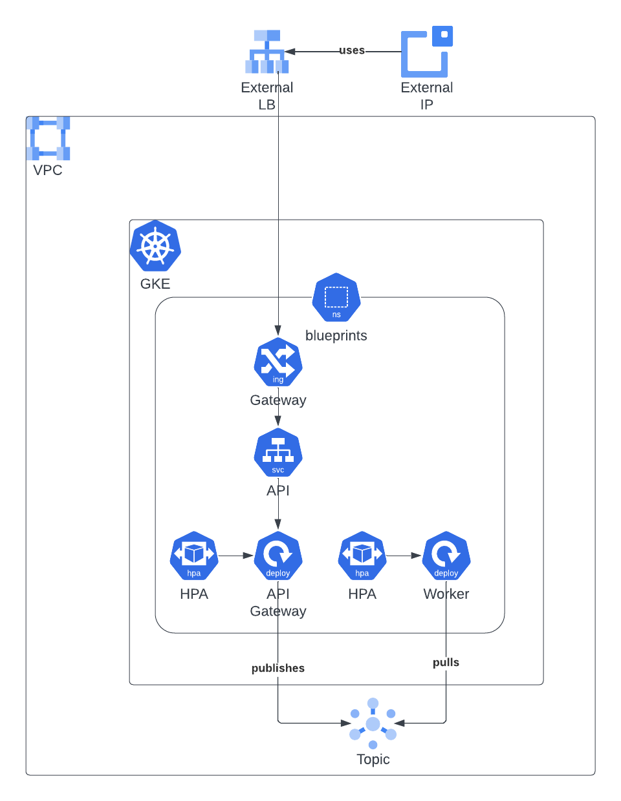

# GKE Observability Workshop LAB-02

## Kubernetes Liveness and Readiness probes

[](#)
[](https://opensource.org/licenses/Apache-2.0)

## Prerequisites

* [Terraform 0.13+](https://developer.hashicorp.com/terraform/downloads) Tool that manages IaC 
* [Google Cloud SDK](https://cloud.google.com/sdk/docs/install) Google Cloud Command Line Interface.
* [kubectl](https://kubernetes.io/docs/tasks/tools/install-kubectl-linux/) The Kubernetes command-line tool, kubectl, allows you to run commands against Kubernetes clusters.
* [Helm 3.0+](https://helm.sh/docs/) Helm is the package manager for Kubernetes.
* [Skaffold](https://skaffold.dev/) Skaffold is a command line tool that facilitates continuous development for container based & Kubernetes applications. It's included as an optional component in Google Cloud SDK and you can install it.
* [K6](https://k6.io/docs/). Grafana k6 is an open-source load testing tool that makes performance testing easy and productive for engineering teams. 

All these tools are available in Google Cloud Cloud Shell which can be [launched](https://cloud.google.com/shell/docs/launching-cloud-shell) from the Google Cloud console.

## Introduction
Once you have deployed the [*GKE Observability Blueprints application*](./app/) we need to add liveness and readiness probes to the containers of our application. It does have the following components:

* [REST API](./app/api). Presents an external REST-based API for telemetry. Validates the input and publish a message on a Pub/Sub topic.
* [Worker processor](../lab-01/app/worker) pulls messages from the Pub/Sub topic as they're available. It scales based on the number of acknowledged messages.



## Preparation

* Assignment of the lab users and playgrounds. Make sure you get access to the GCP project that you will use during the workshop.
* Login to the [Google Cloud console](https://console.cloud.google.com) with the required credentials.
* [Activate Cloud Shell](https://cloud.google.com/shell/docs/launching-cloud-shell) from the Google Cloud console.
* Install [Grafana K6](https://k6.io/docs/get-started/installation/#debian-ubuntu). You will need it later to check that the application has been deployed correctly. *Ignore the warnings that you will receive from Cloud Shell.*
```
sudo gpg -k
sudo gpg --no-default-keyring --keyring /usr/share/keyrings/k6-archive-keyring.gpg --keyserver hkp://keyserver.ubuntu.com:80 --recv-keys C5AD17C747E3415A3642D57D77C6C491D6AC1D69
echo "deb [signed-by=/usr/share/keyrings/k6-archive-keyring.gpg] https://dl.k6.io/deb stable main" | sudo tee /etc/apt/sources.list.d/k6.list
sudo apt-get update
sudo apt-get install k6
```
* Once you've launched your [Cloud Shell Terminal](https://cloud.google.com/shell/docs/use-cloud-shell-terminal), check that all the required components are installed and up-to-date.
```
gcloud version
helm version
kubectl version --client=true --output=yaml
skaffold version
terraform version
k6 version
```

## Add liveness and readiness probes

* Check the code of the [API component](../lab-01/app/api/handlers.go). Find the liveness and readiness endpoints and annotate them.

* Add the liveness and readiness probes to the main container of the template Pod spec in the [API deployment](../lab-01/app/api/k8s/deployment.yaml). You can use [Cloud Editor](https://cloud.google.com/shell/docs/launching-cloud-shell-editor) for that purpose.

## Cluster Application Check / Playground

* Once the application is deployed, check that the application is running.
```shell
$ kubectl get pods -n blueprints
NAME                                 READY   STATUS    RESTARTS   AGE
blueprints-api-5df98f7c4d-w2frz      1/1     Running   0          103s
blueprints-worker-5b44df6bff-qww8c   1/1     Running   0          97s
```

* Run the [K6 test script](./app/loadtest/test.js) and [check that there are no errors](https://k6.io/docs/get-started/results-output/).
```
cd ../lab-01/app/loadtest
k6 run loadtest/test.js
```

## Links
- [Skaffold documentation](https://skaffold.dev/docs)
- [Artifact Registry documentation](https://cloud.google.com/artifact-registry/docs/docker/store-docker-container-images)
- [Deploying Gateways in GKE](https://cloud.google.com/kubernetes-engine/docs/how-to/deploying-gateways)
- [Running K6](https://k6.io/docs/get-started/running-k6/)
- [Configure Liveness, Readiness and Startup Probes](https://kubernetes.io/docs/tasks/configure-pod-container/configure-liveness-readiness-startup-probes/)
