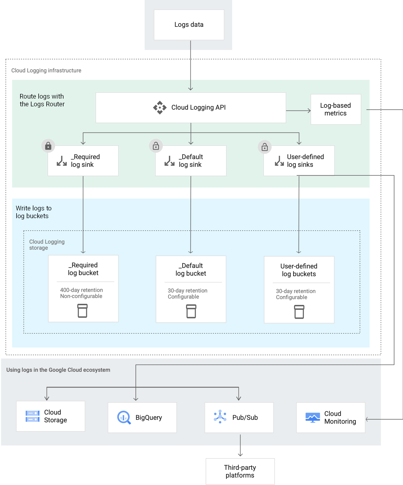

# GKE Observability Workshop LAB-03

## GKE Logging

[](#)
[](https://opensource.org/licenses/Apache-2.0)

## Prerequisites

* [Terraform 0.13+](https://developer.hashicorp.com/terraform/downloads) Tool that manages IaC 
* [Google Cloud SDK](https://cloud.google.com/sdk/docs/install) Google Cloud Command Line Interface.
* [kubectl](https://kubernetes.io/docs/tasks/tools/install-kubectl-linux/) The Kubernetes command-line tool, kubectl, allows you to run commands against Kubernetes clusters.
* [Helm 3.0+](https://helm.sh/docs/) Helm is the package manager for Kubernetes.
* [Skaffold](https://skaffold.dev/) Skaffold is a command line tool that facilitates continuous development for container based & Kubernetes applications. It's included as an optional component in Google Cloud SDK and you can install it.
* [K6](https://k6.io/docs/). Grafana k6 is an open-source load testing tool that makes performance testing easy and productive for engineering teams. 

All these tools are available in Google Cloud Cloud Shell which can be [launched](https://cloud.google.com/shell/docs/launching-cloud-shell) from the Google Cloud console.


## Introduction
* The goal of this lab is to create a logging bucket with analytics enabled. This logging bucket will be associated with a log sink to route application logs to this bucket. * It will use some labels for filtering relevant application logs.
* We will also create another log sink to avoid application logs duplication by filtering out application logs from the `_Default` logging bucket.



## Preparation

* Assignment of the lab users and playgrounds. Make sure you get access to the GCP project that you will use during the workshop.
* Login to the [Google Cloud console](https://console.cloud.google.com) with the required credentials.
* [Activate Cloud Shell](https://cloud.google.com/shell/docs/launching-cloud-shell) from the Google Cloud console.
* Once you've launched your [Cloud Shell Terminal](https://cloud.google.com/shell/docs/use-cloud-shell-terminal), check that all the required components are installed and up-to-date.
```
gcloud version
helm version
kubectl version --client=true --output=yaml
skaffold version
terraform version
```

## Deployment

* Add the label `logs: app-sink` to the Pod template of both [API component](../lab-01/app/api/k8s/deployment.yaml) and [Worker component](../lab-01/app/worker/k8s/deployment.yaml) Deployments to identify the logs emmited from your application. You can use [Cloud Editor](https://cloud.google.com/shell/docs/launching-cloud-shell-editor) for that purpose.
* Deploy the application changes using [Skaffold](https://skaffold.dev/) as in previous labs. Make sure you deploy only [API component](../lab-01/app/api/k8s/deployment.yaml) and [Worker component](../lab-01/app/worker/k8s/deployment.yaml).
* Create a logging bucket named `blueprints-app-logs` with analytics *enabled* and a retention of *10 days*.
* Create a logging sink named `blueprints-app-logs-sink` that route applications logs to the previously created logging bucket.
* Filter the logs based on the *cluster name*, the *resource type* and the *labels* associated to the application pods. 
* Add the exclusion filter to the logging sink named `_Default` to filter out logs coming from the apps. Filter the logs based on the *resource type* and the *labels*.

## Playground Check
* On the **Log Storage** page, the `blueprints-app-logs` bucket appears with analytics enabled.
* On the **Log Router** page, you can see 2 filters:
    - `blueprints-app-logs-sink`: Used to route applications' logs to the `blueprints-app-logs` bucket
    - `blueprints-exclude-app-logs-sink`: Used to avoid application logs duplication in the `_Default` bucket
* On the **Logs Explorer**, using the "Refine scope" button and choosing the `blueprints-app-logs` bucket allows to display only application logs (emitted by the `api` and `worker`).
* On the **Log Analytics** page, you can query application's logs.

Here is a query example:
*(replace `XXX` with your project ID)*
```sql
SELECT
    timestamp, severity, json_payload, JSON_VALUE(json_payload.status), resource
FROM
    `XXX.global.blueprints-app-logs._AllLogs`
WHERE
    JSON_VALUE(resource.labels.container_name) = "api" AND JSON_VALUE(json_payload.status) IS NOT NULL
    LIMIT 10000
```

## Links

- [Configure log buckets](https://cloud.google.com/logging/docs/buckets).
- [Route logs to supported destinations](https://cloud.google.com/logging/docs/export/configure_export_v2).
- [View logs routed to Cloud Logging buckets](https://cloud.google.com/logging/docs/export/using_exported_logs).
- [Query and view logs overview](https://cloud.google.com/logging/docs/log-analytics).
- [Query and view logs in Log Analytics](https://cloud.google.com/logging/docs/analyze/query-and-view).

