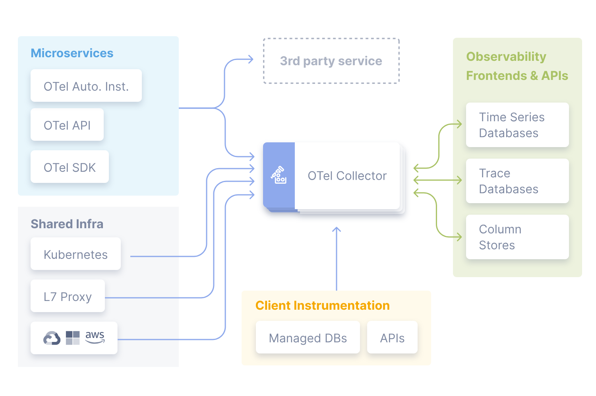

# GKE Observability Workshop LAB-05

## GKE Distributed Tracing

[](#)
[](https://opensource.org/licenses/Apache-2.0)

## Prerequisites

* [Terraform 0.13+](https://developer.hashicorp.com/terraform/downloads) Tool that manages IaC 
* [Google Cloud SDK](https://cloud.google.com/sdk/docs/install) Google Cloud Command Line Interface.
* [kubectl](https://kubernetes.io/docs/tasks/tools/install-kubectl-linux/) The Kubernetes command-line tool, kubectl, allows you to run commands against Kubernetes clusters.
* [Helm 3.0+](https://helm.sh/docs/) Helm is the package manager for Kubernetes.
* [Skaffold](https://skaffold.dev/) Skaffold is a command line tool that facilitates continuous development for container based & Kubernetes applications. It's included as an optional component in Google Cloud SDK and you can install it.
* [K6](https://k6.io/docs/). Grafana k6 is an open-source load testing tool that makes performance testing easy and productive for engineering teams. 

All these tools are available in Google Cloud Cloud Shell which can be [launched](https://cloud.google.com/shell/docs/launching-cloud-shell) from the Google Cloud console.

## Introduction
* We want to use distributed tracing for our [*GKE Observability Blueprints application*](../lab-01/app/). We would like to use the [OpenTelemetry Collector](https://opentelemetry.io/docs/collector/) to collect traces from our application and send them to the Google Cloud Trace backend.  



## Preparation

* Assignment of the lab users and playgrounds. Make sure you get access to the GCP project that you will use during the workshop.
* Login to the [Google Cloud console](https://console.cloud.google.com) with the required credentials.
* [Activate Cloud Shell](https://cloud.google.com/shell/docs/launching-cloud-shell) from the Google Cloud console.
* Once you've launched your [Cloud Shell Terminal](https://cloud.google.com/shell/docs/use-cloud-shell-terminal), check that all the required components are installed and up-to-date.
```
gcloud version
helm version
kubectl version --client=true --output=yaml
skaffold version
terraform version
k6 version
```
## Create OpenTelemetry resources

* Previously, we provisioned the [OpenTelemetry Operator](https://opentelemetry.io/docs/kubernetes/operator/) in our cluster. Now we need to provision the [OpenTelemetry Collector](https://opentelemetry.io/docs/collector/) and configure it to inject autoinstrumentation in our application workloads and send traces to the [Google Cloud Trace](https://cloud.google.com/trace/docs) service.

* Obtain credentials for GKE cluster.
```
gcloud container clusters get-credentials gke-otel-blueprints --region $CLOUDSDK_COMPUTE_REGION
```

* Position yourself in the lab folder.
```
cd ~/gke-observability-workshop/lab-05
```

* Replace `PROJECT_ID_VALUE` in the collector deployment specs using the following command.
```
find . -type f -exec sed -i s/PROJECT_ID_VALUE/$CLOUDSDK_CORE_PROJECT/ {} +
```

* Create the K8s service account with permissions.
```
kubectl apply -f otelcollector/01-rbac.yaml
```

* Configure the GCP IAM resources using Config Connector.
```
kubectl apply -f otelcollector/02-workloadidentity.yaml
```

* Create the [OpenTelemetry Collector](https://opentelemetry.io/docs/collector/). Take a look to the configuration of the collector and try to understand how it works.
```
kubectl apply -f otelcollector/03-collectorconfig.yaml
```

* Create the [OpenTelemetry Instrumentation](https://opentelemetry.io/docs/instrumentation/) resource.
```
kubectl apply -f otelcollector/04-instrumentation.yaml
```
## Deployment

* You need to add the [required autoinstrumentation annotations](https://opentelemetry.io/docs/kubernetes/operator/automatic/#add-annotations-to-existing-deployments) to the Pod template of both [API component](../lab-01/app/api/k8s/deployment.yaml) and [Worker component](../lab-01/app/worker/k8s/deployment.yaml) Deployments to inject the autoinstrumentation sidecar containers. You can use [Cloud Editor](https://cloud.google.com/shell/docs/launching-cloud-shell-editor) for that purpose.

* Deploy the application changes using [Skaffold](https://skaffold.dev/) as in previous labs. Make sure you deploy only [API component](../lab-01/app/api/k8s/deployment.yaml) and [Worker component](../lab-01/app/worker/k8s/deployment.yaml).


## Cluster Application Check / Playground
TODO


## Links

- [OpenTelemetry Operator](https://opentelemetry.io/docs/kubernetes/operator/)
- [OpenTelemetry Collector](https://opentelemetry.io/docs/collector/)
- [OpenTelemetry Collector Configuration](https://opentelemetry.io/docs/collector/configuration/)
- 
- https://kubernetes.io/docs/reference/kubectl/cheatsheet/
- https://phoenixnap.com/kb/kubectl-commands-cheat-sheet